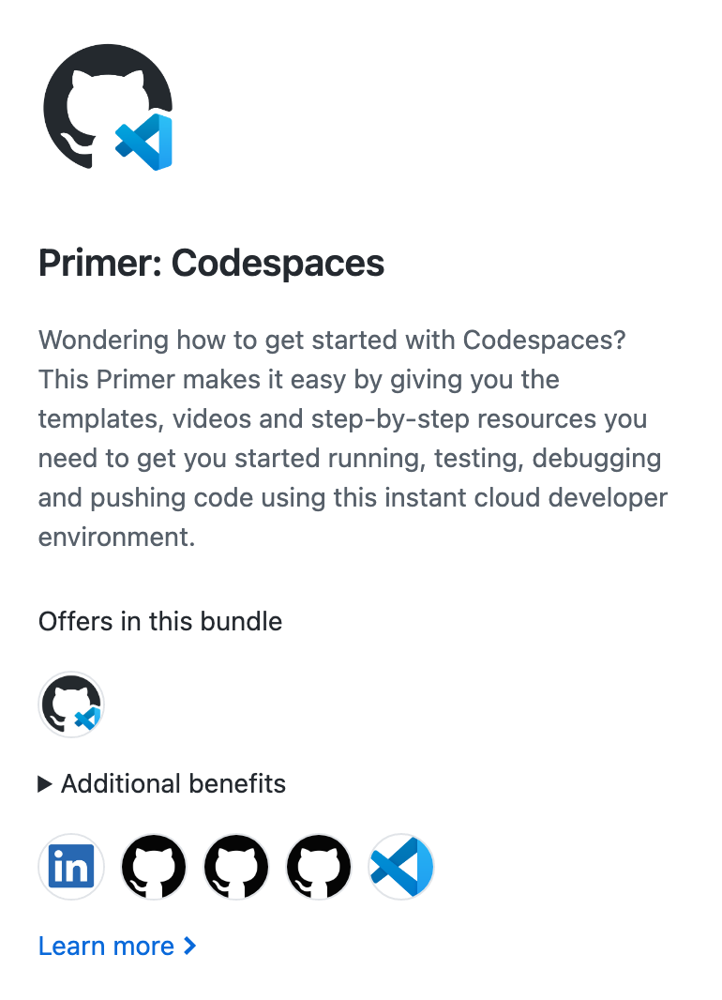
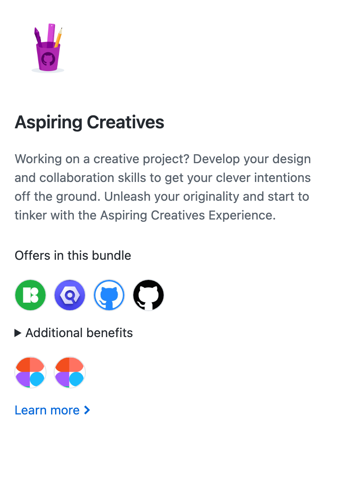
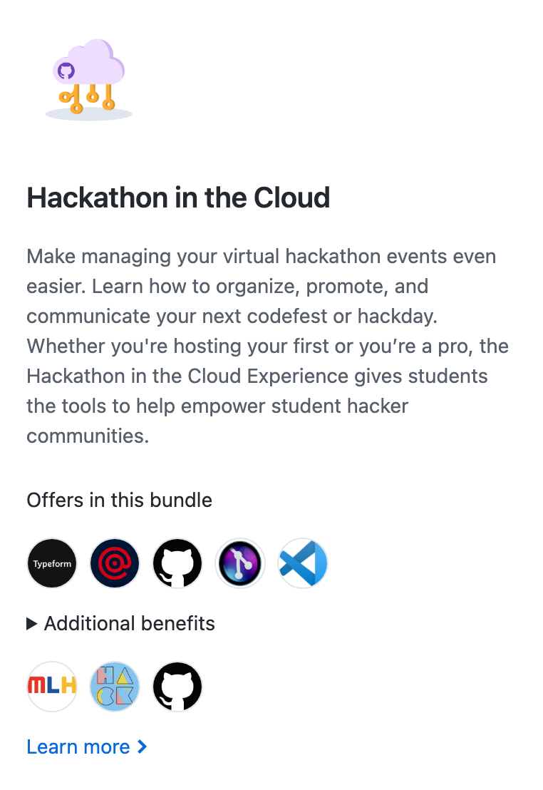
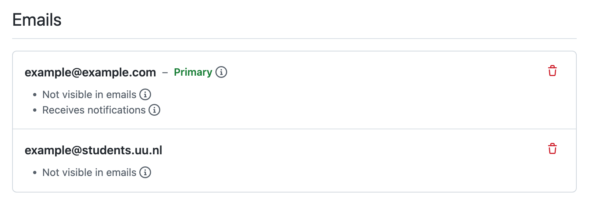

# Github Student Pack

## Benefits

Get acces to over 85 Pro tools and services, as well as experience packs:

 
 

And more!

## How do i join the Global Campus Program?

First make sure you have your school email added to your github account



### Get the benefits

The regular way would be to apply directly on the [github website](https://education.github.com/discount_requests/pack_application).
However Utrecht University is still working on a service where students can request this automatically.
To apply for benefits such as Github Pro you have to [mail the school directly](mailto:research.engineering@uu.nl)

Example email:

```text
Hello, 

I would like acces to the Github Student Developer Pack.

My email is: <example@students.uu.nl>
My student number is: 1234567

Best regards,

<Your name>
```

You will receive an activation link in your inbox. Click the link and you will have acces to students benefits and resources.
